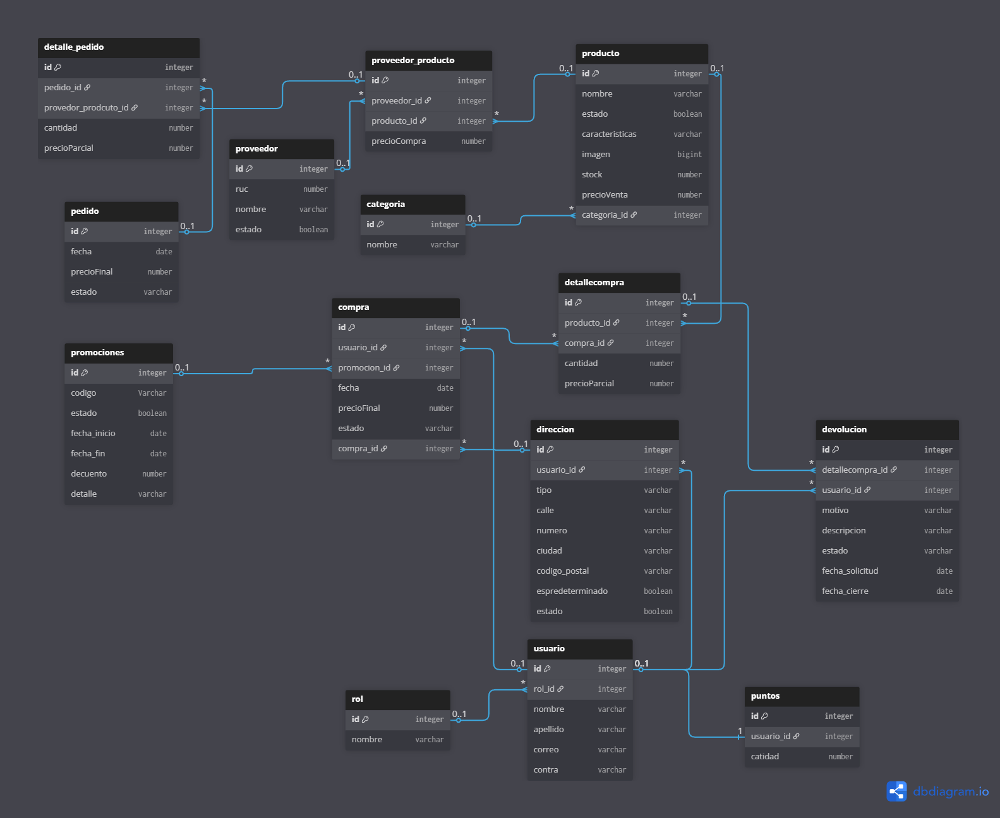

# 🛍️ BrujaStore Backend

Backend de la plataforma de e-commerce **BrujaStore** - Una solución completa para la gestión de tienda en línea con funcionalidades avanzadas de compras, pedidos, devoluciones y sistema de puntos de fidelización.

## 📋 Descripción del Proyecto

BrujaStore es un sistema backend robusto construido con **Spring Boot 3** que proporciona todas las funcionalidades necesarias para administrar una tienda online moderna. La aplicación incluye gestión de productos, categorías, usuarios, pedidos, compras, devoluciones, promociones y un sistema integral de puntos de recompensa.

## 🚀 Requisitos Previos

Antes de iniciar, asegúrate de tener instalado:

- **Java 21** o superior
- **Maven 3.6+**
- **PostgreSQL 12+**
- **Git**

## 🔧 Configuración e Instalación

### 1. Clonar el repositorio

```bash
git clone <tu-repositorio-url>
cd BrujaStoreBackend
```

### 2. Configurar la base de datos

Crea una base de datos PostgreSQL para el proyecto:

```sql
CREATE DATABASE brujastore;
```

### 3. Configurar variables de entorno

Edita el archivo `src/main/resources/application.properties` con tus credenciales:

```properties
# Database Configuration
spring.datasource.url=jdbc:postgresql://localhost:5432/brujastore
spring.datasource.username=tu_usuario
spring.datasource.password=tu_contraseña
spring.jpa.hibernate.ddl-auto=update
spring.jpa.show-sql=false

# Server Configuration
server.port=8080

# Mail Configuration (opcional)
spring.mail.host=tu_host_smtp
spring.mail.port=587
spring.mail.username=tu_email
spring.mail.password=tu_contraseña
```

### 4. Instalar dependencias

```bash
./mvnw clean install
```

### 5. Ejecutar la aplicación

```bash
./mvnw spring-boot:run
```

La aplicación estará disponible en `http://localhost:8080`

## 📁 Estructura del Proyecto

```
src/
├── main/
│   ├── java/com/brujastore/
│   │   ├── BrujastoreApplication.java       # Clase principal
│   │   ├── config/                          # Configuraciones
│   │   │   ├── SecurityConfig.java          # Configuración de seguridad
│   │   │   └── WebConfig.java               # Configuración web
│   │   ├── controller/                      # Controladores REST
│   │   ├── dto/                             # Data Transfer Objects
│   │   ├── entity/                          # Entidades JPA
│   │   ├── repository/                      # Acceso a datos
│   │   └── service/                         # Lógica de negocio
│   └── resources/
│       └── application.properties            # Configuración
└── test/                                     # Pruebas unitarias
```

## 🎯 Características Principales

### 👥 Gestión de Usuarios

- Registro y autenticación de usuarios
- Perfiles de usuario con roles
- Sistema de direcciones múltiples por usuario

### 🛒 Catálogo de Productos

- Gestión de categorías de productos
- Catálogo completo de productos
- Control de proveedores y relaciones con productos
- Gestión de promociones

### 📦 Pedidos y Compras

- Sistema integral de pedidos
- Registro detallado de compras
- Gestión de líneas de detalle en pedidos y compras
- Sistema de devoluciones

### 🎁 Sistema de Puntos

- Acumulación de puntos por compras
- Canje de puntos como descuentos
- Historial de puntos por usuario

### 🔄 Devoluciones

- Gestión de devoluciones de productos
- Seguimiento del estado de devoluciones
- Reembolsos automáticos

## 📡 API Endpoints Principales

### Documentacion postman 
https://speeding-water-204458.postman.co/workspace/Personal-Workspace~c06dd41a-a64e-4858-b5bf-2908c8a07c3d/collection/33347468-df290367-423a-4b18-bc62-aa360ce13b24?action=share&source=copy-link&creator=33347468

### Usuarios

- `POST /api/usuarios/register` - Registrar nuevo usuario
- `POST /api/usuarios/login` - Iniciar sesión
- `GET /api/usuarios` - Obtener lista de usuarios
- `GET /api/usuarios/{id}` - Obtener detalles del usuario

### Productos

- `GET /api/productos` - Listar productos
- `GET /api/productos/{id}` - Obtener detalles del producto
- `POST /api/productos` - Crear producto (admin)
- `PUT /api/productos/{id}` - Actualizar producto (admin)

### Pedidos

- `GET /api/pedidos` - Listar pedidos del usuario
- `POST /api/pedidos` - Crear nuevo pedido
- `GET /api/pedidos/{id}` - Obtener detalles del pedido

### Compras

- `GET /api/compras` - Listar compras
- `POST /api/compras` - Registrar compra
- `GET /api/compras/{id}` - Obtener detalles de compra

### Devoluciones

- `POST /api/devoluciones` - Crear devolución
- `GET /api/devoluciones` - Listar devoluciones
- `PUT /api/devoluciones/{id}` - Actualizar estado de devolución

### Puntos

- `GET /api/puntos/{usuarioId}` - Consultar puntos del usuario
- `POST /api/puntos/canjear` - Canjear puntos

## 🔐 Seguridad

El proyecto implementa:

- **Spring Security** para autenticación y autorización
- **Control de roles** (Admin, Usuario, etc.)
- **Validación de datos** en peticiones
- **Protección CSRF** en configuraciones

## 📦 Dependencias Principales

- **Spring Boot 3.5.3** - Framework principal
- **Spring Data JPA** - ORM y acceso a datos
- **Spring Security** - Seguridad y autenticación
- **PostgreSQL** - Base de datos
- **Lombok** - Reducción de boilerplate
- **Spring Mail** - Envío de correos

nw test
```


## 🗄️ Diagrama de Base de Datos




**Versión:** 0.0.1-SNAPSHOT
